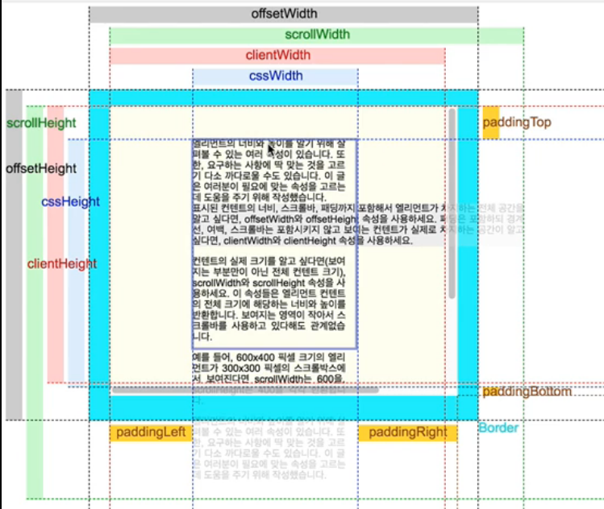

# TIL
오늘 내가 배운 것들(Today I Learned)   

---

<details open>
<summary>1일차 학습</summary>
<div markdown="1">

  #### [DOM]
  - Document Object Model Application Programming Interface
  - HTML, XML 및 SVG 문서를 위한 프로그래밍 인터페이스
  - 문서의 구조화된 표현양식을 트리 형태로 제공
  - [1] ECMAScript
    - 언어 문법 (파싱 규칙, 키워드, 흐름 제어(조건문,반복문), 오브젝트 리터럴 초기화 등)
    - 에러 처리 방법 (throw, try/catch, 유저가 직접 정의한 에러 등)
    - 타입들 (boolean, number, string, function, object...)
    - 전역 오브젝트. 브라우저 환경에서는 window 오브젝트가 전역 오브젝트. 
      몇 가지의 함수들이 이 오브젝트에 포함 됨(parseInt, parseFloat, ... 등).
    - 프로토타입을 기반으로한 상속 구조
    - 내장 객체 및 함수들(JSON, Math, Array, Object, ... 등).
  
  - [2] DOM
    - 문서 구조, 트리 모델(tree model), DOM core에 있는 이벤트 구조. 
      Node, Element, Document, Event, EventTarget, ... 등
    - 덜 엄격한 DOM 이벤트 구조, DOM events에 속하는 특정 이벤트.
    - DOM 탐색(Traversal), DOM 영역(Range) 등.


  - DOM 선택 API 메서드
    - getElementById()
    - getElementsByTagName()
    - getElementsByClassName()(IE9+)
    - querySelector()(IE8+CSS2선택자로제한,IE9+)
    - querySelectorAll()
    - matches() (IE9+ ms 프리픽스 필요)
      msMatcheSelector()

  - Node속성
    - childNodes
    - firstChild
    - lastChild
    - nextSibling
    - previousSibling
    - parentNode
    - nodeType
    - nodeName
    - nodeValue

  - Node메서드
    - hasChildNodes()
    - appendChild()
    - insertBefore()
    - removeChild()
    - replaceChild()
    - cloneNode()
    - contains()
    - isEqualNode()(IE9+)
    - compareDocumentPosition()(IE9+)

  - Document메서드
    - createElement() : 요소를 생성
    - createTextNode() : 텍스트 노드를 생성

  - HTML*Element속성
    - children
    - firstElementChild
    - lastElementChild
    - nextElementSibling
    - previousElementSibling
    - attributes(이속성을통해반환되는유사배열집합은라이브상태,즉실시간으로변경된다)
    - innerHTML
    - outerHTML
    - innerText
    - textContent(IE9+)
    - childElementCount(IE9+)
    - classList(IE10+)
      - add()
      - remove()
      - contains()
      - toggle()
    - dataset(JavaScript객체로 data‑*속성에 사용된 ‑은 모두 camelCase로 처리하여 사용)
</details>

<details open>
<summary>2일차 학습</summary>
<div markdown="1">

  #### [Document/Node]
  - 문서 객체 동적 생성 및 제거, 복제
    - .hasChildNodes() : 현재 노드(Node)에게 자식노드(child nodes)가 있는지를 Boolean 값으로 반환
      ```javascript
      node.hasChildNodes()
      ```
    - .appendChild() : 한 노드를 특정 부모 노드의 자식 노드 리스트 중 마지막 자식으로 붙인다. 
      ```javascript
      var aChild = element.appendChild(aChild);
      ```
    - .insertBefore() : 참조된 노드 앞에 특정 부모 노드의 자식 노드를 삽입 
      ```javascript
      var insertedNode = parentNode.insertBefore(newNode, referenceNode);
      ```
    - .createTextNode() : 텍스트 노드를 생성
      ```javascript
      텍스트 = document.createTextNode(데이터);
      ```
    - .removeChild() : DOM에서 하위 노드를 제거하고 제거 된 노드를 리턴
      ```javascript
        var oldChild = node.removeChild(child);
        OR
        node.removeChild(child);
      ```
    - .replaceChild() : 특정 부모 노드의 한 자식 노드를  다른 노드로 교체
      ```javascript
        replacedNode = parentNode.replaceChild(newChild, oldChild);
      ```
    - .cloneNode() : 이 메서드를 호출한 Node 의 복제된 Node를 반환
      ```javascript
      var dupNode = node.cloneNode(deep);
      ```
    - .contains() : 주어진 인자가 node 의 자손인지, 아닌지에 대한 Boolean 값을 리턴
      ```javascript
      node.contains( otherNode ) 
      ```
    - .isEqualNode() : 두 노드가 같은지 테스트
      ```javascript
        var isEqualNode = node.isEqualNode(otherNode);
      ```
    - .compareDocumentPosition() : 현재 노드와 문서 안의 다른 노드와의 위치를 비교
      ```javascript
        compareMask = node.compareDocumentPosition(otherNode)

        const head = document.head;
        const body = document.body;

        if (head.compareDocumentPosition(body) === Node.DOCUMENT_POSITION_FOLLOWING) {
          console.log('Well-formed document');
        } else {
          console.error('<head> is not before <body>');
        }
      ```
    - .insertAfter : 헬퍼함수로 만듬
      ```javascript
        function insertAfter(insert, target) {
            var parent = target.parentNode;
            if(parent.lastElementChild.isEqualNode(target)){
                parent.appendChild(insert);
            }else{
                var next = target.nextElementSibling;
                parent.insertBefore(insert, next);
            }

        }

        insertAfter(document.createElement('div'), document.querySelector('.brand'));
        insertAfter(document.createElement('span'), $0);
      ```
</details>

<details open>
<summary>3일차 학습</summary>
<div markdown="1">

  #### [ElementNode 속성 / 메서드]

  #### HTML Element 속성

  - children : live HTML Collection
    ```javascript
    Array.prototype.forEach.call(document.head.querySelectorAll('script'), function(script){
        script.parentNode.removeChild(script)
    });

    document.head.children
    HTMLCollection(7) [meta, title, base, link, style#chs, link, link, chs: style#chs]
    ```
  - firstElementChild
  - lastElementChild
  - nextElementSibling
  - previousElementSibling
  - attributes(이 속성을 통해 반환되는 유사 배열 집합은 라이브 상태, 즉 실시간으로 변경된다) 
  - innerHTML
  - outerHTML
  - innerText
    - innerText vs textContent : textContent는 태그로 인식하지 않는다.
    ```javascript
    document.querySelector('.footer-tos');
    <ul class=​"footer-tos">​…​</ul>​

    document.querySelector('.footer-tos').innerHTML;
    "<li><a href="https://www.mozilla.org/about/legal/terms/mozilla">Terms</a></li>
    <li><a href="https://www.mozilla.org/privacy/websites/">Privacy</a></li>
    <li><a href="https://www.mozilla.org/privacy/websites/#cookies">Cookies</a></li>"

    document.querySelector('.footer-tos').innerHTML = '<li>체인지</li>'
    "<li>체인지</li>"

    document.querySelector('.footer-tos').outerHTML
    "<ul class="footer-tos"><li>체인지</li></ul>"

    document.querySelector('.footer-tos').innerText
    "체인지"
    ```
  - classList(IE 10+)
    - add()
    - remove()
    - contains()
    - toggle()

  #### HTML Element 메서드
  - getAttribute( )
  - setAttribute( )
  - removeAttribute( )
  - hasAttribute( ) - 속성이 있으면 값이 없어도 true를 반환
  - insertAdjacentHTML( )
  - insertAdjacentElement()
  - insertAdjacentText()
  - insertAdjacentHTML( )

    ```javascript
      element.insertAdjacentHTML(position, text);

      position은 아래 있는 단어만 사용 가능하다.
      'beforebegin'
      element 앞에 
      'afterbegin'
      element 안에 가장 첫번째 child
      'beforeend'
      element 안에 가장 마지막 child
      'afterend'
      element 뒤에

      <!-- beforebegin -->
      <p>
      <!-- afterbegin -->
      foo
      <!-- beforeend -->
      </p>
      <!-- afterend -->
    ```

  - insertAdjacentElement()
    ```javascript
    targetElement.insertAdjacentElement(position, element);
    beforeBtn.addEventListener('click', function() {
      var tempDiv = document.createElement('div');
      tempDiv.style.backgroundColor = randomColor();
      if (activeElem) {
        activeElem.insertAdjacentElement('beforebegin',tempDiv);
      }
      setListener(tempDiv);
    });
    afterBtn.addEventListener('click', function() {
      var tempDiv = document.createElement('div');
      tempDiv.style.backgroundColor = randomColor();
      if (activeElem) {
        activeElem.insertAdjacentElement('afterend',tempDiv);
      }
      setListener(tempDiv);
    });
    ```

  - insertAdjacentText() 
    ```javascript
    element.insertAdjacentText(position, text);

    beforeBtn.addEventListener('click', function() {
      para.insertAdjacentText('afterbegin',textInput.value);
    });

    afterBtn.addEventListener('click', function() {
      para.insertAdjacentText('beforeend',textInput.value);
    });
    ```
</details>
<details open>
<summary>4일차 학습</summary>
<div markdown="1">

  #### [HTML 요소 스타일 속성 / 메서드]
  #### element.style
  ```javascript
  // Set multiple styles in a single statement
  elt.style.cssText = "color: blue; border: 1px solid black"; 
  // Or
  elt.setAttribute("style", "color:red; border: 1px solid blue;");

  // Set specific style while leaving other inline style values untouched
  elt.style.color = "blue";
  ```

- Window.getComputedStyle() 
  - 요소의 모든 CSS 프로퍼티값을 얻기 위한 방법
  - 전역함수
  - 인자로 전달받은 요소의 모든 CSS 속성값을 담은 객체를 회신

  ```javascript
  var style = window.getComputedStyle(element[, pseudoElt]);
  <style>
  h3::after {
    content: ' rocks!';
  }
  </style>
  <h3>generated content</h3> 
  <script>
    var h3       = document.querySelector('h3');
    var result   = getComputedStyle(h3, ':after').content;

    console.log('the generated content is: ', result); // returns ' rocks!'
  </script>

  window.getComputedStyle($0)['font-size']
  "18px"
  window.getComputedStyle($0).fontSize
  "18px"
  window.parseInt(window.getComputedStyle($0).fontSize, 10)
  18
  window.parseInt(window.getComputedStyle($0).fontSize, 10) + 2
  20
  window.parseInt(window.getComputedStyle($0).fontSize, 10) + 2 + 'px'
  "20px"
  $0.style.fontSize = window.parseInt(window.getComputedStyle($0).fontSize, 10) + 2 + 'px'
  "20px"
  ```
  #### CSS 객체 모델
  - CSSOM(CSS Object Model)
  - CSSOM View Module 사양의 대부분 속성은 라이브 상태로, 접근 시마다 매번 계산되며, 읽기 전용 속성이다. (scrollLeft, scrollTop은 제외)
      
  - 요소의 크기(Dimensions) : width, height
    - clientWidth, clientHeight : 너비/높이(width/height) + 패딩(padding)
    -   offsetWidth, offsetHeight : 너비/높이(width/height) + 패딩(padding) + 보더(border) + 스크롤바
    - scrollWidth, scrollHeight : 스크롤 가능한 너비/높이 영역

    
</details>
<details open>
<summary>5일차 학습</summary>
<div markdown="1">

  #### [ES6] Module
- import : 외부 모듈이나 다른 스크립트 등으로부터 export된 기능을 가져오는데 사용
- export : 지정된 파일(또는 모듈)에서 함수 또는 오브젝트, 원시 타입들을 export 하는데 사용